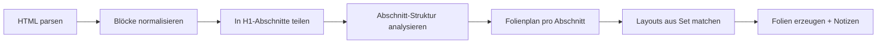

# Logos Importer — Briefing

> **Handoff:** *„Lies `docs/LOGOS_IMPORTER.md` und setze [AENDERUNGEN.md](AENDERUNGEN.md) B #7 um.“*

**Status:** Briefing **bereit** · **pausiert** (Vorlage «Schlicht II») · **AENDERUNGEN:** [B #7](AENDERUNGEN.md) · ursprünglich **v2.1.3** — siehe [RELEASES.md](RELEASES.md)  
Stand: 2026-07-08 · Basis: **v2.1.2** (Logos-Import seit v2.1.0)

Verwandt: [RELEASE_v2.1.0.md](../.github/RELEASE_v2.1.0.md) · [samples/logos-sermon-test.html](samples/logos-sermon-test.html) (lokal, nicht im Git)

---

## Ziel

Den Logos-Predigt-Import **abschnittsweise** statt blockweise steuern: Pro **H1-Abschnitt** die Struktur darunter analysieren und die **passendsten Layout-Folien** aus dem Set wählen — nicht mehr „erster Treffer pro Einzelblock“.

Weiterhin: ein Konfigurationsmodell (Folien-Set), klare Pipeline, wartbarer Code.

---

## Kernidee: H1-Abschnitte statt Einzelblöcke

### Problem heute

Der Importer läuft **linear** durch alle HTML-Blöcke. Für jeden Block (H1, Fliesstext, Liste, Bibelstelle …) wird isoliert entschieden:

1. Zone (`slides` / `notes` / …) aus dem Set lesen
2. **`findLayoutSlideForRole()`** — erste Layout-Folie im Filmstreifen, die ein Platzhalter-Feld für diese Rolle hat
3. **Eine neue Folie** mit genau diesem einen Inhalt

```text
H1 «Einleitung»           → Folie A (erstes heading1-Layout)
Fliesstext                → Folie B (erstes normal-Layout)
H2 «Unterpunkt»           → Folie C (erstes heading2-Layout)
Fliesstext                → Folie D (wieder normal-Layout)
Bibelstelle               → Folie E (scripture_block-Layout)
```

**Folge:** Viele einzelne Folien, obwohl im Set Layouts existieren, die **mehrere Rollen kombinieren** (z. B. «Überschrift und Inhalt», «Abschnitt», «Bibelstelle mit Referenz + Vers»). Diese werden nicht genutzt, weil nie der **Kontext unter einem H1** betrachtet wird.

### Zielverhalten (Vorschlag)

Die Predigt wird in **H1-Abschnitte** zerlegt. **Jeder H1 startet einen neuen Abschnitt**; alles bis zum nächsten H1 gehört strukturell dazu.

```text
[Vorspann: document_title, Meta …]     ← vor erstem H1, Sonderregeln

── Abschnitt 1: H1 «Die Liebe Gottes» ──
   H2 «Grundlage»
   Fliesstext
   Bibelstelle (Ref + Verse)
   3× Listenpunkt
   → Abschnitt analysieren → Folienplan mit passenden Layouts

── Abschnitt 2: H1 «Anwendung» ──
   Fliesstext
   Fliesstext
   Illustration (lighttext)
   → erneut analysieren → eigener Folienplan
```

**Prinzip:** Erst **Struktur verstehen**, dann **Layouts zuordnen** — nicht umgekehrt.

---

## Ist-Zustand (v2.1.0+)

1. User exportiert Predigt in **Logos Sermon Builder** als **Webseite (HTML)**.
2. Dashboard → **Importieren** → HTML hochladen.
3. SlideForge erkennt Logos-Export (`LogosSermonImporter::isLogosExport`).
4. User wählt ein **Folien-Set** (ab v2.1.3 **Pflicht**; Legacy entfällt).
5. `LogosSermonImporter::import()` parst HTML-Blöcke — heute noch **blockweise**, siehe [Problem heute](#problem-heute).

| Pfad | v2.1.2 | v2.1.3 |
|------|--------|--------|
| **Set** | `buildSlidesFromLayoutSet()` | bleibt — einziger Pfad |
| **Legacy** | `buildSlidesLegacy()` · `SermonImportTemplate.php` | **entfernt** |

**Relevante Dateien:** `src/LogosSermonImporter.php`, `src/LayoutSet.php`, `public_html/import.php`, `public_html/templates.php`

---

## Vorgeschlagene Pipeline



| Phase | Input | Output | Beschreibung |
|-------|--------|--------|--------------|
| **1. Parsen** | Logos-HTML | flache Blockliste | wie heute (`parseBlocks`) |
| **2. Abschnitte** | Blockliste | `Section[]` | Split an jedem `heading1` (H1); Vorspann optional separat |
| **3. Struktur** | `Section.blocks` | Segment-Baum | H2–H5 als Untergliederung; Gruppen aus `normal`, `list_item`, `scripture_block`, … |
| **4. Folienplan** | Segment-Baum | `SlidePlan[]` | Welche Inhalte auf **eine** Folie gehören |
| **5. Layout-Match** | `SlidePlan` + Set | Layout-Folie | Beste passende Vorlage im Set (Score, nicht nur «erster Treffer») |
| **6. Erzeugen** | Layout + Inhalte | SF-Folien | `fillSlideFromLayout()`; Rest → Notizen laut Zonen |

---

## Abschnitts-Modell

### Section (H1-Abschnitt)

```php
[
  'title' => 'Die Liebe Gottes',      // H1-Text
  'blocks' => [ /* bis zum nächsten H1 */ ],
  'segments' => [ /* nach Phase 3 */ ],
]
```

### Vorspann (vor erstem H1)

`document_title`, ggf. `meta`, einleitende Elemente → **eigene Phase**, nicht in H1-Abschnitt 1 mischen.

- Titelfolie wie heute (`document_title`-Zone)
- Optional: Inhalte vor erstem H1 als Notizen an Titelfolie oder eigene Folie (Set-abhängig)

### Segmente innerhalb eines Abschnitts

Abschnitts-Analyse erkennt **inhaltliche Cluster** — nicht jeden Block einzeln:

| Segment-Typ | Typische Blöcke | Beispiel-Layout im Set |
|-------------|-----------------|-------------------------|
| **section_opener** | nur H1 | `abschnitt`, `heading1` |
| **heading_content** | H2/H3 + 1× Fliesstext | `ueberschrift_und_inhalt` |
| **heading_multi** | H2 + 2× Fliesstext | `ueberschrift_und_zwei_inhalte` |
| **scripture** | `scripture_block` (Ref + Verse) | `scripture_block` mit zwei Feldern |
| **bullet_group** | aufeinanderfolgende `list_item` | Layout mit `list_item` oder mehreren `normal` |
| **quote** | `lighttext`, `prompt` | `lighttext`-Layout |
| **notes_only** | `normal`, `meta`, … (Zone = notes) | keine Folie — Sprechernotizen |

Unter-H1-Überschriften (H2–H5) **gliedern** den Abschnitt, lösen aber **keinen** neuen Abschnitt aus (nur H1).

---

## Layout-Matching (statt «erster Treffer»)

### Heute

```php
LayoutSet::findLayoutSlideForRole($setId, 'normal', $setMeta);
// → erste Folie im Filmstreifen mit normal-Platzhalter
```

### Neu: Score pro SlidePlan

Für jeden geplanten Folien-Inhalt (`SlidePlan`: Rollen → Texte) alle Layout-Folien im Set bewerten:

| Kriterium | Gewicht | Beispiel |
|-----------|---------|----------|
| Alle benötigten Rollen abgedeckt | hoch | Plan `{heading2, normal}` → Layout mit beiden Feldern |
| Keine leeren Pflicht-Felder | mittel | Lieber kein Layout mit 3 Feldern, wenn nur 2 befüllt |
| `layoutKey`-Semantik passt | mittel | `ueberschrift_und_inhalt` bei H3+Text |
| Explizite Zuordnung im Set (`logosLayoutSlideIds`) | hoch | User hat Rolle → Folie zugewiesen |
| Reihenfolge im Filmstreifen | niedrig | Tie-Breaker bei gleichem Score |

```text
SlidePlan: { heading2: «Grundlage», normal: «Gott ist Liebe…» }

Kandidaten im Set:
  Folie «Überschrift+Inhalt»  → Score 95  ✓
  Folie «Überschrift H2»      → Score 40  (nur heading2)
  Folie «Fliesstext»          → Score 20  (nur normal)
```

**Regel:** Immer das Layout mit **höchstem Score** wählen; Fallback wie heute (einzelne Rolle, erster Treffer).

### Mehrere Folien pro Abschnitt

Ein H1-Abschnitt erzeugt **typischerweise 2–n Folien**, aber **geplant**:

1. **Eröffnungsfolie** — H1 allein (`section_opener`)
2. **Inhaltsfolien** — je nach Segment-Clustern (H2+Text, Bibelstelle, Liste, …)
3. **Notizen** — alles mit Zone `notes` an die **aktuelle Abschnittsfolie** (wie heute `notesBucket`, aber abschnittsbezogen)

---

## Beispiel (konkret)

**Logos-HTML (vereinfacht):**

```html
<h1>Die Liebe Gottes</h1>
<h2>Schriftstelle</h2>
<div class="scripture">…</div>
<p>Erklärung zum Text …</p>
<ul><li>Punkt 1</li><li>Punkt 2</li></ul>

<h1>Anwendung</h1>
<p>Was bedeutet das für uns?</p>
<p>Praktischer Schritt …</p>
```

**Heute (blockweise):** ~7 Folien — je Block eine, meist Minimal-Layouts.

**Neu (abschnittsweise):**

| Folie | Layout (Set) | Inhalt |
|-------|----------------|--------|
| 1 | `abschnitt` | H1 «Die Liebe Gottes» |
| 2 | `scripture_block` | H2 «Schriftstelle» + Bibelstelle (wenn Layout H2-Feld hat → sonst H2 auf Folie 1 in Notizen) |
| 3 | `ueberschrift_und_inhalt` oder Notizen | Erklärungstext |
| 4 | Listen-Layout / Notizen | 2 Listenpunkte |
| 5 | `abschnitt` | H1 «Anwendung» |
| 6 | `ueberschrift_und_zwei_inhalte` **oder** 2× normal in Notizen | beide Fliesstexte |

*(Feinheiten bei H2+Scripture: siehe offene Fragen — ggf. Scripture-Segment hat Vorrang vor heading_content.)*

---

## Randfälle

| Situation | Vorschlag |
|-----------|-----------|
| **Kein H1 in der Predigt** | Ganzer Text = ein Abschnitt; H2–H5 als Gliederung |
| **H1 in Zone `notes`** | Kein Abschnitts-Split; H1 landet in Notizen wie heute |
| **Leerer Abschnitt** (nur H1, kein Inhalt) | Eine Folie mit `section_opener`-Layout |
| **`scripture_block` mitten im Abschnitt** | Eigenes Segment, eigenes Layout — bricht **kein** H1 ab |
| **Viele `list_item`** | Gruppierung laut Tab «Logos Import» (`listGrouping`) |
| **Layout fehlt im Set** | Fallback: heutiges Verhalten + Warnung im Import-Log |
| **Legacy Import-Vorlage** | entfällt mit v2.1.3 |
| **Langer Fliesstext** | Split bei `textMaxCharacters` (Satz-/Wortgrenze) |

---

## Auswirkung auf Set-Editor

**Umgesetzt als Tab «Logos Import»** im Dialog **Element Einstellungen** (siehe [Konfiguration im Set-Editor](#konfiguration-im-set-editor-element-einstellungen)).

Optional später: Layout-Folien mit Metadaten «geeignet für» (`section_opener`, …) — **MVP** inferiert weiterhin aus Platzhalter-Rollen + `layoutKey`-Heuristik.

---

## Zielbild (Entwurf — vom Owner zu bestätigen)

### MUSS

1. **H1-Abschnitts-Pipeline:** Parse → Abschnitte → Struktur → Folienplan → Layout-Match → Folien (siehe oben).
2. **Ein Konfigurationsmodell:** Nur Folien-Set; Legacy (`SermonImportTemplate`) **vollständig entfernen**.
3. **Set-gesteuertes Verhalten:** Zonen, Notizen-Reihenfolge, Vorlageelemente — Abschnittslogik respektiert Zonen.
4. **Set-UI:** Tabs **Zuweisungen | Logos Import** im Dialog **Element Einstellungen**; Import-Optionen pro Set speicherbar.

### SOLL

5. **Layout-Scoring** statt «erster Treffer pro Rolle».
6. **Import-Vorschau (MUSS für v2.1.3):** Modal nach Upload — geplante Abschnitte/Folien anzeigen, dann bestätigen oder abbrechen.
7. **Bessere Warnungen** — «Abschnitt 2: kein passendes Layout für H2+Text» (auch in der Vorschau).
8. **Re-Import** — gleiche HTML-Datei erneut importieren (Update vs. Kopie — Entscheidung nötig).

### NICE

9. **Profil-Presets** — Standard-Set pro User merken.
10. **Weitere Import-Optionen** im Tab (z. B. Fliesstext-Gruppierung, Abschnitts-Ebene H2).
11. **Batch** — mehrere Predigten importieren.

---

## Konfiguration im Set-Editor (Element Einstellungen)

Die bisher **offenen Import-Fragen** werden **pro Folien-Set** im Dialog **Element Einstellungen** eingestellt — nicht global, nicht im Profil.

### Tab-Leiste (wie Dashboard)

Gleiches Layout wie Dashboard (`page-tabs` / `page-tab-btn` in `index.php`):

```text
| Zuweisungen | Logos Import |
```

| Tab | Inhalt |
|-----|--------|
| **Zuweisungen** | **Aktueller Dialog** unverändert: Textvorlagen (Standard + Logos) und Logos-Zonen (Folien / Notizen / …) im Zwei-Spalten-Layout |
| **Logos Import** | **Neu:** Import-Verhalten für die H1-Abschnitts-Pipeline (siehe unten) |

- Tab **Logos Import** nur sichtbar, wenn `logosImporterEnabled` (Profil) **und** Set-Editor (`elementLinksModal`).
- Standard-Tab beim Öffnen: **Zuweisungen**.
- Speichern über bestehenden Button → `save_layout_set_settings` (Metadaten im Set, Export via `.chs`).

**Betroffene Stellen:** `editor.php` (`#elementLinksModal`), `editor.js` (`renderElementLinksModalBody`, `initElementLinksModal`), `api.php`, `LayoutSet.php`, i18n.

### Tab «Logos Import» — Felder

Die Import-Optionen werden **pro Folien-Set** im Tab **Logos Import** eingestellt:

#### 1. Überschrift 1 – Eröffnungsfolie

*Frage: Immer separate Folie für H1, oder mit erstem Inhalt kombinieren?*

| Wert | Bezeichnung (DE) | Verhalten |
|------|------------------|-----------|
| `always_separate` | Immer eigene Folie | Pro H1-Abschnitt zuerst `section_opener`-Layout (nur H1) |
| `combine_with_first` | Mit erstem Inhalt kombinieren | H1 wird mit erstem passenden Segment (H2+Text, Scripture, …) auf **einer** Folie geplant, wenn Layout-Score ausreicht |

**Standard (Default):** `always_separate`

#### 2. Überschrift vor Bibelstelle (H2 + Scripture)

*Frage: H2 «Schriftstelle» und `scripture_block` — eine Folie oder zwei?*

| Wert | Bezeichnung (DE) | Verhalten |
|------|------------------|-----------|
| `scripture_always_separate` | Bibelstelle immer eigenständig | Scripture-Segment = eigene Folie; vorherige H2 → Notizen oder eigene Folie |
| `combine_if_layout_fits` | Kombinieren wenn Layout passt | H2 + Scripture auf einer Folie, wenn Set-Layout beide Rollen abdeckt (Score ≥ Schwelle) |
| `always_combined` | Immer kombinieren | H2 + Scripture immer gemeinsam planen; Fallback: Scripture-Folie + H2 in Notizen |

**Standard (Default):** `combine_if_layout_fits`

#### 3. Listen gruppieren

*Frage: Max. wie viele Listenpunkte pro Folie?*

| Wert | Bezeichnung (DE) | Verhalten |
|------|------------------|-----------|
| `1` | Ein Punkt pro Folie | wie heute blockweise |
| `3` / `5` | Max. 3 / 5 Punkte | `bullet_group`-Segmente in Batches |
| `0` | Unbegrenzt | alle aufeinanderfolgenden `list_item` eines Abschnitts auf eine Folie (Layout permitting) |
| `layout` | Layout-abhängig | Anzahl = passende Platzhalter im gewählten Listen-Layout |

**Standard (Default):** `layout`

#### 4. Fliesstext trennen / gruppieren

*Frage: Ab wann werden Fliesstexte (`normal`, Zone `slides`) auf mehrere Folien verteilt bzw. zusammengefasst?*

**Empfehlung: Zeichen, nicht Zeilen**

| Kriterium | Zeilen | Zeichen |
|-----------|--------|---------|
| Vorhersagbarkeit | Schlecht — hängt von Schriftgrösse, Vorlage, Zeilenumbruch ab | Gut — einheitliche Schwelle pro Set |
| Logos-Export | Jeder `<p>` ist bereits ein Block | Passt zu langen Absätzen und Gruppierung |
| Trennung | Unklar, wo «eine Zeile» endet | Trennung an **Satzende**, sonst Wortgrenze |

**Zwei Fälle (beide über dasselbe Feld gesteuert):**

1. **Mehrere kurze Absätze** hintereinander → auf einer Folie sammeln, bis `maxCharacters` erreicht → neue Folie.
2. **Ein langer Absatz** → bei Überschreitung von `maxCharacters` an Satz-/Wortgrenze teilen → Folienkette.

UI analog zu «Listen pro Folie» — Dropdown mit Presets + optional Freitext:

| Wert | Bezeichnung (DE) | Verhalten |
|------|------------------|-----------|
| `280` | Kurz (ca. 280 Zeichen) | v. a. Folien mit wenig Textplatz |
| `500` | Mittel (ca. 500 Zeichen) | Standard-Predigttext |
| `800` | Lang (ca. 800 Zeichen) | grosse Textflächen im Set |
| `0` | Unbegrenzt | kein Split; jeder Logos-Absatz bleibt ein Segment (Gruppierung nur via Layout-Score) |
| `layout` | Layout-abhängig | Schwelle aus Platzhalter-Grösse + Textvorlage schätzen |

**Standard (Default):** `500`

Speicherfeld: `textMaxCharacters` (Zahl oder `layout` / `0` als Sonderwerte).

### UI-Skizze Tab «Logos Import»

```text
┌─ Element Einstellungen ─────────────────────────────┐
│  … Beschreibung …                                          │
│  | Zuweisungen | Logos Import |                            │
│  ─────────────────────────────────────────────────────── │
│                                                            │
│  Überschrift 1 – Eröffnungsfolie                           │
│  [ Immer eigene Folie ▼ ]                                  │
│                                                            │
│  Überschrift + Bibelstelle                                 │
│  [ Kombinieren wenn Layout passt ▼ ]                       │
│                                                            │
│  Listen pro Folie                                          │
│  [ Layout-abhängig ▼ ]                                     │
│                                                            │
│  Fliesstext pro Folie (max. Zeichen)                       │
│  [ Mittel · ca. 500 Zeichen ▼ ]                            │
│                                                            │
│                              [ Schliessen ]  [ Speichern ] │
└────────────────────────────────────────────────────────────┘
```

### Persistenz (Set-Metadaten)

Neues Objekt in Set-Meta (Vorschlag):

```json
"logosImportSettings": {
  "h1Opener": "always_separate",
  "scriptureHeading": "combine_if_layout_fits",
  "listGrouping": "layout",
  "textMaxCharacters": 500
}
```

- Speicherung in `Presentation`/`LayoutSet`-Meta neben `elementZones`, `logosNotesOrder`.
- `.chs`-Export/Import inkludieren.
- Seed «Schlicht»: Defaults wie oben.
- `LogosSermonImporter` liest Settings beim Import über gewähltes Set.

### i18n (neu, DE-Beispiele)

| Key | DE |
|-----|-----|
| `elements.element_links_tab_assignments` | Zuweisungen |
| `elements.element_links_tab_logos_import` | Logos Import |
| `elements.logos_import_h1_opener` | Überschrift 1 – Eröffnungsfolie |
| `elements.logos_import_scripture_heading` | Überschrift + Bibelstelle |
| `elements.logos_import_list_grouping` | Listen pro Folie |
| `elements.logos_import_text_max_chars` | Fliesstext pro Folie (max. Zeichen) |
| … | Optionen je Feld (EN/FR/IT/RM analog) |

---

## Import-Vorschau (v2.1.3)

Nach Upload einer Logos-HTML-Datei und Auswahl des Folien-Sets **vor** dem Anlegen der Präsentation im Dashboard.

### Ablauf

1. User wählt Datei + Folien-Set auf `import.php` (wie heute).
2. Statt sofort zu importieren: **«Vorschau»** / automatischer Dry-Run → Server liefert Folienplan (ohne Präsentation zu speichern).
3. **Modal** zeigt:
   - Predigt-Titel
   - Liste der **geplanten Folien** (Reihenfolge, Layout-Name/`layoutKey`, Kurzinhalt pro Rolle)
   - **H1-Abschnitte** als Gruppierung (einklappbar)
   - **Warnungen** (fehlendes Layout, Fallback, übersprungene Elemente)
4. Buttons: **«Importieren»** (Präsentation anlegen) · **«Abbrechen»** · optional **«Zurück»** (Set/Datei ändern)

### Technik (Vorschlag)

| Teil | Umsetzung |
|------|-----------|
| API | Neuer Endpoint z. B. `preview_logos_import` in `import.php` oder `api.php` — ruft `LogosSermonImporter::import()` bzw. neue `planImport()` ohne `Presentation::create` |
| Response | `{ title, sections: [{ title, slides: [{ layoutKey, roles, previewText, warnings }] }], warnings: [] }` |
| UI | Modal auf Import-Seite; gleicher Stil wie bestehende Modals |
| i18n | `import.preview_heading`, `import.preview_confirm`, … (DE/EN/FR/IT/RM) |

### Akzeptanz (Vorschau)

- [ ] Vorschau erscheint bei Logos-HTML + gewähltem Set **bevor** die Präsentation existiert.
- [ ] Anzahl Folien in Vorschau = Anzahl nach bestätigtem Import.
- [ ] Warnungen sind in Vorschau und finalem Import identisch.

**Release:** Patch **v2.1.3** (zusammen mit H1-Pipeline, Tab «Logos Import», `logosImportSettings`).

---

## Legacy-Aufräumen (#1)

**Entscheidung:** Legacy-Pfad entfernen — **möglichst wenig Code**, nur noch Import über **Folien-Set**.

### Entfernen / vereinfachen

| Bestandteil | Aktion |
|-------------|--------|
| `LogosSermonImporter::buildSlidesLegacy()` | **Löschen** |
| Fallback ohne `layoutSetId` in `import()` | **Entfernen** — Set ist Pflicht bei Logos-Import |
| `src/SermonImportTemplate.php` | **Löschen** (nach Verschieben nötiger Defaults) |
| `data/sermon_import_templates.json` | **Nicht mehr befüllen**; bestehende Datei ignorieren |
| `templates.php` — CRUD Import-Vorlagen | **Entfernen** (Legacy-API) |
| `import.php` — Legacy-Vorlagen-Dropdown | **Entfernen** (`import.logos_template_label_legacy`) |
| `config.php` — `SermonImportTemplate::ensureDefaults()` | **Entfernen** |
| `ElementLink.php` — Defaults aus `SermonImportTemplate` | **Defaults inline** in `ElementLink` / `LayoutSet` |

### Verhalten neu

- Logos-HTML **ohne** gewähltes Folien-Set → Fehlermeldung (Link zum Set anlegen), kein stilles Fallback.
- Ein Import-Pfad: `buildSlidesFromLayoutSet()` + `logosImportSettings`.
- Weniger UI, weniger i18n, weniger Tests.

### Migration

- Bestehende User mit Logos-Import: Set-Auswahl war schon Standard — kein Daten-Migrations-Script nötig.
- `.chs`-Sets exportieren alle Import-relevanten Meta-Felder.

---

## Offene Fragen

| # | Frage | Optionen | Entscheidung |
|---|--------|----------|--------------|
| 1 | Legacy `SermonImportTemplate` entfernen? | — | **Ja — vollständig aufräumen**, nur Set-Import |
| 2 | H2 + `scripture_block` — eine Folie oder zwei? | — | **→ Tab Logos Import** (`scriptureHeading`) |
| 3 | Eröffnungsfolie pro H1? | — | **→ Tab Logos Import** (`h1Opener`) |
| 4 | Listen gruppieren — max. pro Folie? | — | **→ Tab Logos Import** (`listGrouping`) |
| 5 | Fliesstexte — gruppieren / trennen? | Zeilen · Zeichen | **→ Tab Logos Import** (`textMaxCharacters`); **Zeichen** (Satz-/Wortgrenze) |
| 6 | `scripture_block` — immer Folie oder zone-gesteuert? | — | **Zonen bleiben**; Tab steuert nur H2+Scripture-Kombination |
| 7 | Import-Vorschau im Scope? | — | **Ja — Modal vor dem Anlegen der Präsentation** |
| 8 | Ziel-Release? | — | **Patch (v2.1.3)** |

*Alle Punkte entschieden — Briefing bereit für Umsetzung.*

---

## Feature-Details

### Feature: H1-Abschnitts-Import (Kern)

| Feld | Inhalt |
|------|--------|
| **Priorität** | MUSS |
| **Wo** | `LogosSermonImporter::buildSlidesFromLayoutSet()` → neue Hilfsklassen/Methoden |
| **Verhalten** | Predigt in H1-Abschnitte teilen; pro Abschnitt Segmente bilden; Folienplan mit Layout-Scoring; liest `logosImportSettings` aus Set-Meta |
| **Grenzen** | Nur Logos-HTML; Abschnittsgrenze = H1 (H2–H5 innerhalb) |
| **Nicht** | Kein KI-/LLM-Layout-Raten; kein direkter Logos-API-Zugriff |
| **Akzeptanz** | Test-Predigt: weniger Folien bei gleichem Inhalt; kombinierte Layouts werden genutzt; Einstellungen aus Tab «Logos Import» wirken beim Import |
| **Technik** | `splitIntoSections()`, `analyzeSection()`, `planSlides()`, `matchLayout()`; Tests mit `docs/samples/` |

### Feature: Element Einstellungen — Tabs Zuweisungen | Logos Import

| Feld | Inhalt |
|------|--------|
| **Priorität** | MUSS |
| **Wo** | `#elementLinksModal`, `editor.js`, `api.php` (`save_layout_set_settings`), `LayoutSet.php` |
| **Verhalten** | Dashboard-Tab-Leiste (`page-tabs`); Tab **Zuweisungen** = bisheriger Inhalt; Tab **Logos Import** = vier Optionen (H1, Scripture+H2, Listen, Fliesstext/Zeichen) |
| **Akzeptanz** | Speichern persistiert `logosImportSettings`; `.chs`-Roundtrip; Tab nur bei aktivem Logos-Import |
| **Technik** | Set-Meta-Feld `logosImportSettings`; Defaults in Seed «Schlicht» |

### Feature: Legacy entfernen

| Feld | Inhalt |
|------|--------|
| **Priorität** | MUSS |
| **Wo** | `LogosSermonImporter.php`, `SermonImportTemplate.php`, `import.php`, `templates.php`, `ElementLink.php`, `config.php` |
| **Verhalten** | Nur Set-Import; Legacy-Klasse und -UI löschen; Defaults inline |
| **Akzeptanz** | Logos ohne Set → klare Fehlermeldung; kein toter Code |

### Feature: Import-Vorschau

| Feld | Inhalt |
|------|--------|
| **Priorität** | SOLL → **v2.1.3 MUSS** |
| **Wo** | `import.php`, ggf. `LogosSermonImporter::planImport()`, Modal-UI |
| **Verhalten** | Dry-Run nach Datei+Set; Modal mit Abschnitten, Folienplan, Warnungen; Bestätigung legt Präsentation an |
| **Akzeptanz** | Vorschau = finales Ergebnis; Abbrechen ohne Seiteneffekt |

### Feature: Einheitlicher Import über Folien-Set

| Feld | Inhalt |
|------|--------|
| **Priorität** | MUSS |
| **Wo** | Import-Dialog, Legacy entfernen |
| **Verhalten** | Set-Pfad mit Abschnitts-Pipeline; Legacy deprecaten |
| **Akzeptanz** | Logos-Import erfordert Set; kein Legacy-Code mehr |

---

## Bekannte Schwächen („relativ starr“)

- [x] **Blockweises Layout-Matching** — → **Lösung: H1-Abschnitte**
- [x] **Zwei parallele Konfigurationsmodelle** (Set vs. Legacy) → **Lösung: Legacy löschen (#1)**
- [ ] **Monolithischer Importer** — Parsing, Routing, Folien-Erzeugung in einer Klasse.
- [ ] **Feste Elementtypen** — neue Logos-Export-Varianten erfordern Code-Änderungen in mehreren Stellen.
- [ ] **Sonderlogik Bibelstellen** — `scripture_block` / Verse / Inline teils ausserhalb des Zonenmodells.
- [ ] **Kein Import-Vorschau** — Ergebnis erst nach Upload sichtbar → **Lösung: Modal v2.1.3**
- [ ] **Wenig Rückmeldung** — Warnungen generisch, keine Zuordnung „Abschnitt X → Folie Y“.
- [ ] **Testbarkeit** — wenig isolierte Unit-Tests für Parsing/Routing.

---

## Akzeptanzkriterien (Grob)

- [ ] Import teilt Predigt an **jedem H1** in Abschnitte.
- [ ] Pro Abschnitt werden **kombinierte Layouts** bevorzugt, wenn Inhalt und Set das hergeben.
- [ ] Layout-Wahl per **Score**, nicht nur `findLayoutSlideForRole()` für Einzelrolle.
- [ ] Dialog **Element Einstellungen**: Tabs **Zuweisungen | Logos Import** (Dashboard-Tab-Stil).
- [ ] Tab **Logos Import**: H1, Scripture+H2, Listen, **Fliesstext (max. Zeichen)** — speicherbar pro Set.
- [ ] Logos-Import **nur mit Folien-Set** (Legacy entfernt).
- [ ] Import respektiert gespeicherte `logosImportSettings`.
- [ ] Fliesstext-Split an **Satz-/Wortgrenze** bei `textMaxCharacters`. (weniger Einzelfolien, bessere Optik).
- [ ] Set «Schlicht» / Prod-Sets: keine Regression (Defaults = heutiges Verhalten wo sinnvoll).
- [ ] i18n DE / EN / FR / IT / RM für Tab und Felder.
- [ ] **Import-Vorschau:** Modal mit Folienplan vor dem Anlegen der Präsentation (Logos + Set).
- [ ] Doku: Profil-Hilfe, Import-Hinweise, dieses Briefing aktualisiert.

**Ziel-Release:** Patch **v2.1.3**

## Getroffene Entscheidungen

| # | Frage | Entscheidung | Begründung |
|---|--------|--------------|------------|
| 1 | Abschnittsgrenze | **H1** | Struktur unter H1 analysieren, pro H1 wiederholen |
| 2 | Matching-Strategie | **Kontext zuerst, dann Layout** | Nicht blockweise «erster Treffer» |
| 3 | Import-Optionen (H1 / Scripture / Listen) | **Pro Set im Tab «Logos Import»** | Owner: konfigurierbar unter Element Einstellungen, nicht global hardcodiert |
| 4 | Tab-UI | **Zuweisungen \| Logos Import** | Gleiches Tab-Layout wie Dashboard (`page-tabs`) |
| 5 | Zonen vs. Import-Tab | **Zonen bleiben unter Zuweisungen** | Folien/Notizen-Zuordnung getrennt von Abschnitts-Import-Logik |
| 6 | Import-Vorschau | **Ja — Modal vor Import** | Owner: «wäre sehr gut» — Dry-Run + Bestätigung |
| 7 | Ziel-Release | **Patch v2.1.3** | Kleiner Scope; baut auf v2.1.0–v2.1.2 auf |
| 8 | Legacy-Code | **Entfernen, minimaler Pfad** | Owner: aufräumen, wenig Code |
| 9 | Fliesstext-Trennung | **Zeichen** (`textMaxCharacters`) | Zeilen layout-abhängig; Zeichen + Satzgrenze stabiler |

---

## Ursprüngliche Idee (Rohtext)

> Aus [AENDERUNGEN.md](AENDERUNGEN.md) B #7: *Import heute relativ starr — neue Importroutine.*
>
> Owner (2026-07-08): *Struktur unter H1 analysieren; passende Vorlagen pro Abschnitt.*
>
> Owner (2026-07-08): *Die drei Import-Fragen (H1-Folie, H2+Scripture, Listen) im Menü Vorlageelemente konfigurierbar — Tabs «Zuweisungen | Logos Import», gleiches Layout wie Dashboard.*

> Owner (2026-07-08): *Import-Vorschau ja (Modal). Ziel-Release: Patch v2.1.3.*

> Owner (2026-07-08): *Legacy aufräumen — möglichst wenig Code. Fliesstext-Schwelle im Tab Logos Import (Zeichen statt Zeilen).*

---

## Nächste Schritte

1. ~~Offene Fragen~~ — **alle entschieden**.
2. Reale Logos-HTML-Exports in `docs/samples/` (gitignored).
3. Umsetzung **v2.1.3:** Legacy entfernen → Tab + `logosImportSettings` → H1-Pipeline → Import-Vorschau → Eintrag #7 von B nach C.

---

## Technische Rahmenbedingungen

- PHP 8.2+, kein Composer, dateibasiert (`data/`)
- Keine Breaking Changes an `.chs`-Format ohne Migrationspfad (`logosImportSettings` in Meta)
- Logos-Import optional pro User (`Auth::logosImporterEnabled`); Tab «Logos Import» nur bei aktivem Logos-Profil
